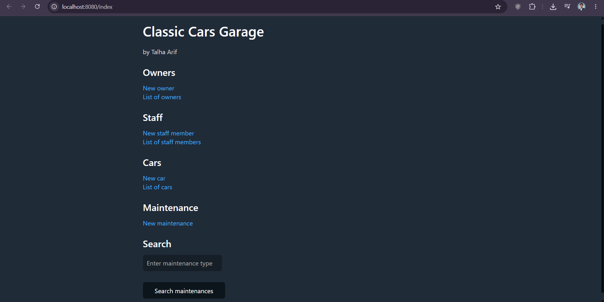
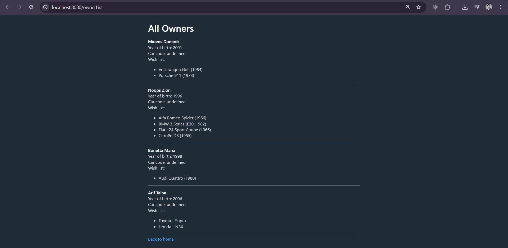
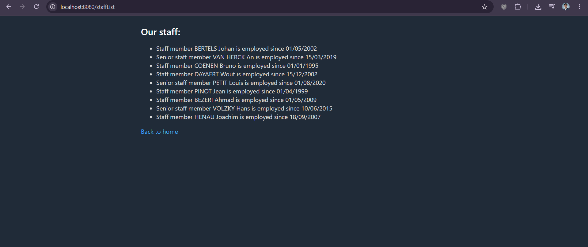
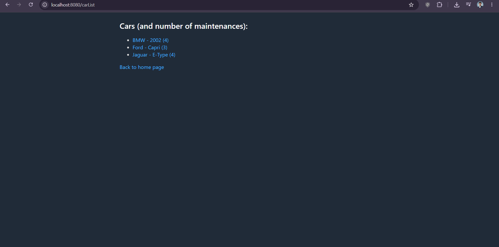
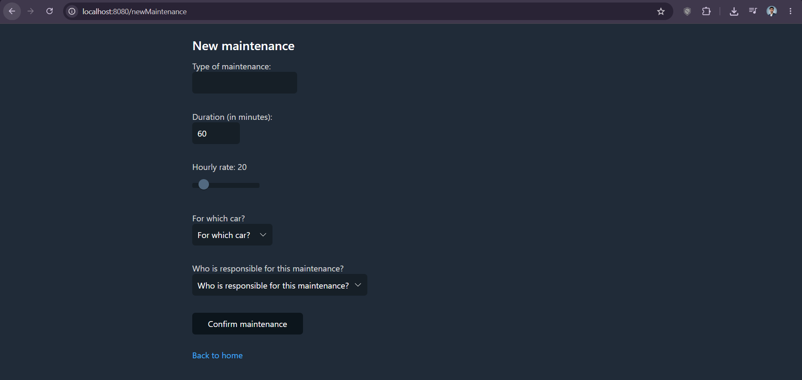

# Classic Cars – Java Spring Boot MVC Application

A Java web application for managing a classic car business: registering owners and staff, cataloguing cars, and logging maintenance records. Built as a progression from an object-oriented class model into a full Spring Boot MVC application.



## Overview

Classic Cars models the people and vehicles involved in running a classic car dealership: owners who wish-list cars, staff who perform maintenance, cars that accumulate maintenance history, and the relationships between them. The project started as a plain object-oriented class model, validated with unit tests, and was then extended into a working Spring Boot MVC web application with Thymeleaf templates.

## Features

- Register new owners, with a wishlist of up to 5 cars each
- Register new staff members, including a senior/junior status and start date
- Add cars to the catalog, each with a photo and running kilometer count
- Log maintenance records against a car, assigned to a staff member
- Search maintenance records across all cars by type
- Automatic car-owner registration codes generated from brand, type and mileage
- Server-side validation and a dedicated error page for invalid form submissions

## Technologies

- Java 17
- Spring Boot 2.7.1 (Spring MVC)
- Thymeleaf (server-rendered HTML templates)
- Maven
- JUnit 5

## Architecture

```
Browser
   ↓
Thymeleaf templates (View)
   ↓
MainController (Controller)
   ↓
Model classes: Owner, Staff, Car, Maintenance (in-memory ArrayLists)
```

`MainController` holds three in-memory lists — owners, staff and cars — seeded with sample data on startup. Each `@GetMapping` serves a form or list view; each `@PostMapping` processes a submitted form, updates the in-memory data, and returns the resulting Thymeleaf page.

## Object-Oriented Design

```
Person (firstName, surName, nationality)
├── Owner   (yearOfBirth, carCode, wishlist of up to 5 cars)
└── Staff   (startDate, senior flag)

Car (brand, type, kilometers, photo)
└── holds a list of Maintenance records

Maintenance (type, duration, hourlyRate, assigned Staff)
```

`Owner` and `Staff` both extend `Person` and reuse its `toString()` formatting. A `Car` generates a unique owner registration code from its brand, type and mileage (e.g. `OP_KA_12345`) when an owner registers to it.

## Testing

Unit tests in `src/test/java` cover the model layer with JUnit 5:

- **CarTests** – constructors, setters (including that mileage can't decrease), maintenance search
- **MaintenanceTests** – default/partial/full constructors and setters
- **OwnerTests, PersonTests, StaffTests** – inheritance behaviour, wishlist limits, formatted output

## Running the Project

**Prerequisites:** JDK 17.

The project was built in IntelliJ IDEA. The simplest way to run it:

1. Open the project folder in IntelliJ (File → Open)
2. Let it import the Maven dependencies automatically
3. Set the project SDK to Java 17 (File → Project Structure → Project)
4. Open `ProjectclassiccarsApplication.java` and click the green ▶ run button next to `main`

If you have Maven installed separately, you can instead run:

```bash
mvn spring-boot:run
```

Then open `http://localhost:8080/index` in a browser.

Run the tests with:

```bash
mvn test
```

## Project Structure

```
src/
├── main/
│   ├── java/tm/itbachelors/projectclassiccars/
│   │   ├── ProjectclassiccarsApplication.java
│   │   ├── controller/MainController.java
│   │   └── model/           # Person, Owner, Staff, Car, Maintenance
│   └── resources/
│       ├── templates/       # Thymeleaf HTML pages
│       └── static/img/      # Car photos
└── test/java/.../           # JUnit test classes
```

## Screenshots

### Home page
The landing page, with navigation to owners, staff, cars, maintenance and the maintenance search.


### Owner list
All registered owners, with their year of birth, generated car code and wishlist.



### Staff list
All staff members, showing their start date and senior/junior status.



### Car list
The car catalog, showing each car and how many maintenance records it has.



### New maintenance form
The form for logging a maintenance record, linking a type, duration and hourly rate to a specific car and staff member.



## What I Learned

This project helped me understand how object-oriented programming can model a real-world system, and how individual classes work together as part of a larger application. Moving from the class model to a full MVC web application clarified how the different layers connect — from data and business logic through to controllers and the user interface.
